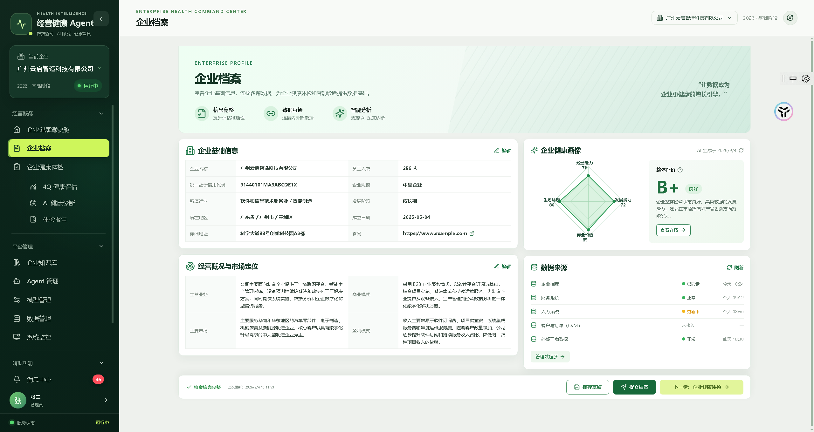
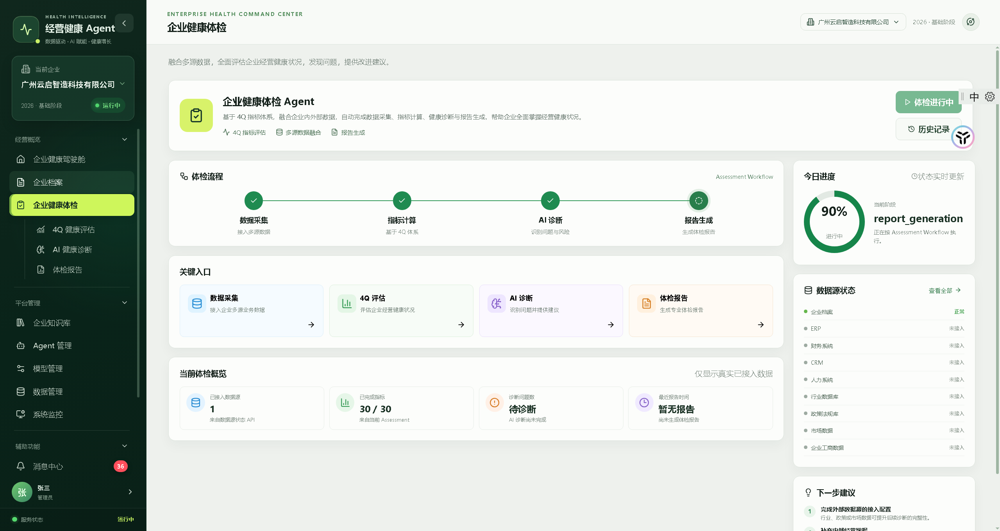
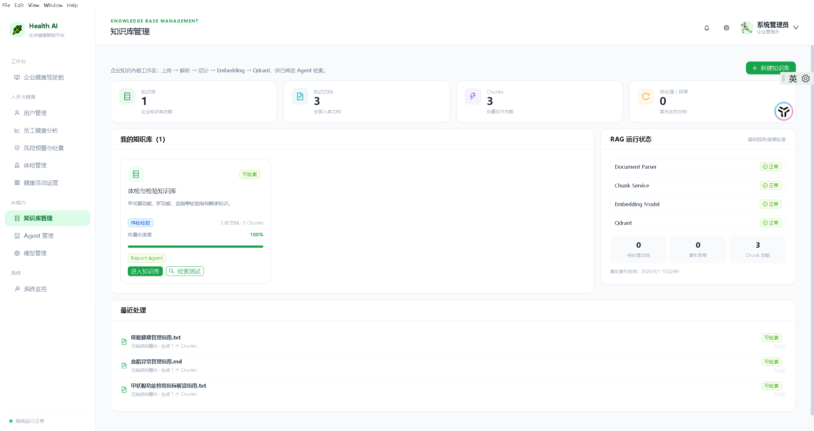
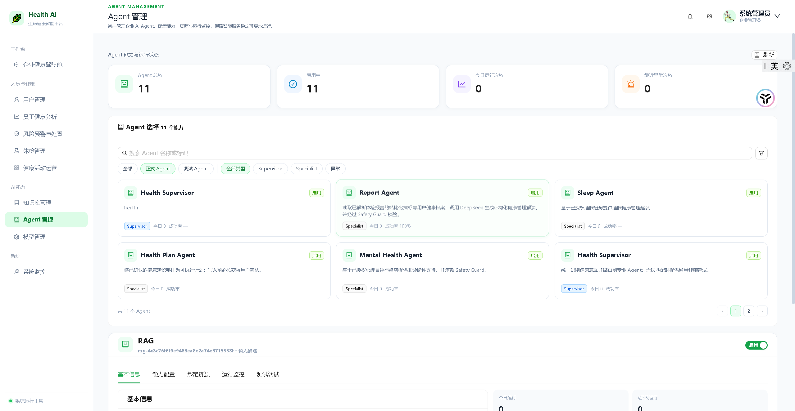
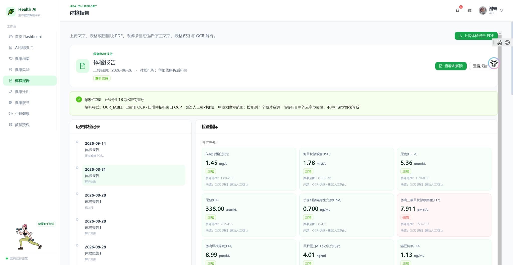
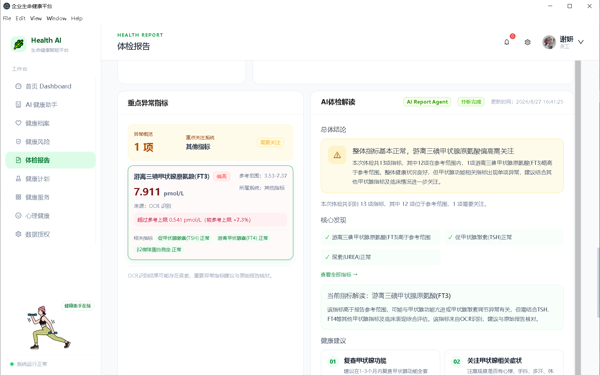

# 企业生命健康智能体平台

企业生命健康智能体平台是一个面向企业员工与健康管理员的 AI Agent 平台，围绕健康档案、体检报告、风险识别、健康计划、心理健康和健康服务，提供可追踪、可授权的健康管理能力。

项目当前同时支持浏览器访问和 Electron 桌面端运行。平台默认使用本地 Docker 基础设施，适合本地开发、功能演示和二次开发。

## 核心能力

- 健康智能问答和会话管理
- Supervisor + Specialist 多 Agent 路由
- Tool Calling 与 Agent 运行记录
- 健康档案、风险、计划、心理和服务模块
- PDF 体检报告解析、OCR fallback 与通用指标抽取
- 知识库文档处理、Semantic Chunk、Embedding、Qdrant 检索
- Knowledge Base / Agent / Tool / Model 绑定
- Top-K 检索测试与来源信息追踪
- 管理员驾驶舱、员工管理、体检管理和 Agent 管理
- JWT 认证、RBAC 和数据授权
- PostgreSQL、Redis、Qdrant、MinIO Docker 基础设施

部分高级 Agent 策略和运营数据依赖实际数据库数据、知识文档和模型配置；没有真实数据时页面会显示空状态或“未配置”，不会把演示数据当作生产统计。

## 技术架构

### Frontend

- Electron
- React 19
- TypeScript
- Vite
- Ant Design
- Axios
- Zustand
- ECharts

### Backend

- Python 3.12+
- FastAPI
- Uvicorn
- SQLAlchemy Async + asyncpg
- JWT + RBAC
- RapidOCR / PaddleOCR / Docling（体检报告和文档解析）

### Infrastructure

- PostgreSQL 16
- Redis 7
- Qdrant
- MinIO

### AI

- DeepSeek Provider 配置
- Agent Runtime
- Tool Calling
- RAG / Knowledge Search
- Embedding 与向量检索

## 项目结构

```text
.
├── backend/                 # FastAPI 后端、数据库模型、Agent、Tool、RAG
├── frontend/                # React + Vite + Electron 前端
├── data/                    # 本地运行数据目录（不提交）
├── deploy/                  # 部署相关文件
├── references/              # 设计与技术参考资料
├── readme/                  # 项目过程文档
├── docker-compose.yml       # PostgreSQL/Redis/Qdrant/MinIO/Backend
├── start-platform.bat       # Windows 一键启动脚本
├── .env.example             # 环境变量模板
└── README.md
```

## 环境要求

- Windows 10/11 或 Linux/macOS
- Docker Desktop
- Node.js 20+
- npm 10+
- Python 3.12+（仅需本地直接运行后端时）

## 环境变量

复制模板并填写本地配置：

```powershell
Copy-Item .env.example .env
```

至少需要设置 PostgreSQL、MinIO 的本地密码；如果需要调用外部模型，再填写 `DEEPSEEK_API_KEY`。`.env` 只保存在本机，禁止提交到 Git。

## 启动方式

### Windows 一键启动

双击根目录的 `start-platform.bat`。脚本会启动 Docker 服务、等待后端并启动 Vite/Electron。

### Docker 启动后端和基础设施

```powershell
docker compose up -d --build
docker compose ps
```

### 单独启动前端

```powershell
cd frontend
npm install
npm run dev
```

### 单独启动后端

```powershell
uvicorn backend.app.main:app --host 0.0.0.0 --port 8002
```

## 访问方式

启动成功后，终端会输出当前机器的 Local URL 和 LAN URL。默认端口为：

- 前端：`5341`
- 后端：`8002`
- API 文档：`http://127.0.0.1:8002/docs`
- 健康检查：`http://127.0.0.1:8002/health`

不要把某台电脑的固定局域网 IP 写入 README；局域网地址以启动脚本和 Vite 的实际输出为准。

## RAG 文档链路

```text
MinIO 原始文档
  → Document 元数据
  → 文本解析与 Semantic Chunk
  → Embedding
  → Qdrant 向量索引
  → KnowledgeSearchTool Top-K Retrieval
  → Agent 领域授权过滤
  → 来源/页码证据
```

专业 Agent 只能检索授权知识库；员工健康上下文还需经过数据授权检查。

## 安全说明

- 不要提交 `.env`、API Key、数据库密码、MinIO 密钥或 Token。
- 不要上传真实员工健康数据、体检 PDF、个人头像或生产数据库文件。
- 不要将 `node_modules`、构建产物、Docker volume、Qdrant/MinIO 运行目录提交到 Git。
- 生产部署时请替换所有本地开发密码，并限制 CORS、数据库和对象存储的网络暴露范围。

## License

License：待确定

## 开源前检查

```powershell
git status
git ls-files
docker compose ps
```

确认 `.env`、本地健康数据、运行数据、密钥和大文件均未进入提交后，再创建 GitHub 仓库并推送。
## 📸 项目预览

### 🏠 平台首页 / 健康驾驶舱

展示企业生命健康智能体平台的整体工作台，包括健康数据、核心指标和智能分析入口。



---

### 🤖 AI Health Agent

AI 健康智能体工作台，通过大模型与 Agent 能力进行健康问题理解、数据分析和智能建议。



---

### 📚 知识库与 RAG

平台知识库用于管理健康领域知识，并为 AI Agent 提供知识检索与 RAG 上下文支持。



---

### 🏗️ 系统架构

平台采用前后端分离与 Agent 化架构，整合模型服务、知识库、工具调用及基础设施能力。



### 🩺 体检报告与 AI 解读

支持上传体检报告 PDF，自动进行文本、表格及 OCR 解析，提取体检指标并识别异常项。

<p align="center">
  
</p>

系统可基于解析后的真实体检指标调用 AI Report Agent，对异常指标、关联指标和健康建议进行结构化解读。

<p align="center">
  
</p>

---
