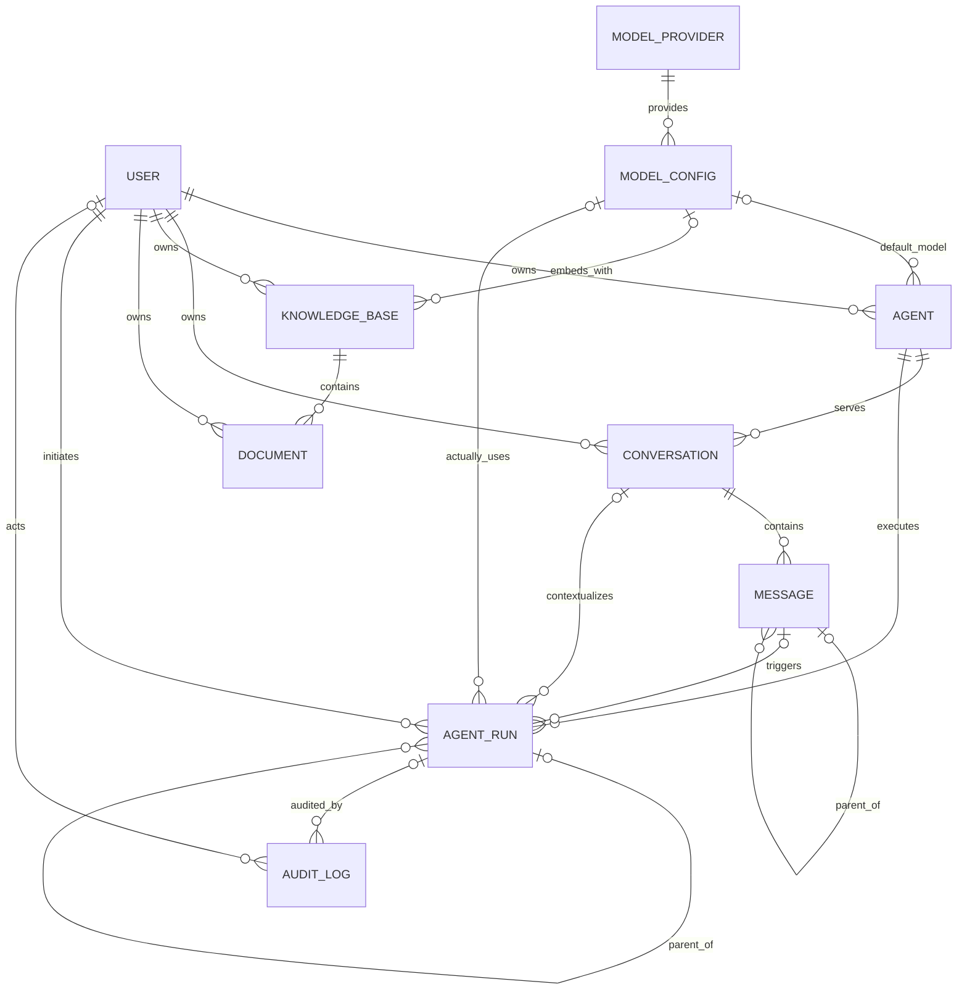

# 1. 调研目标

本报告面向 Personal Health Agent 第一版 PostgreSQL 设计，以工作区内真实源码为依据，研究 Dify、Langflow 与 RAGFlow 的身份、Agent、模型、会话、知识库、工具、工作流及执行记录设计。目标是得到一个最小可用、边界清晰、适合 Python/FastAPI/SQLAlchemy 2.x、同时满足生命健康安全追溯要求的 P0 数据模型。

调研约束与结果状态：

- 已分析：`references/dify/api/models`、`references/dify/api/migrations`、`references/dify/api/repositories`、`references/dify/api/services`。
- 已分析：`references/langflow-main/src/backend/base/langflow/services/database/models`、`references/langflow-main/src/backend/base/langflow/services/jobs`、`references/langflow-main/src/backend/base/langflow/api`、`references/langflow-main/src/backend/base/langflow/alembic`。
- 已分析：`references/ragflow/api/db/db_models.py`、`references/ragflow/api/db/services`、`references/ragflow/rag/svr/task_executor.py`、`references/ragflow/tools`。
- 未修改任何参考仓库、Backend、Frontend 或 Compose 文件。
- 目录说明：下载的 Langflow 源码实际目录名为 `references/langflow-main`，报告使用真实路径。
- Git revision 未验证：参考仓库的 Git 元数据不作为本报告依据。以下结论对应当前工作区源码快照。

# 2. Dify 数据库设计分析

## 2.1 用户与工作空间

源码：`references/dify/api/models/account.py`

- `Account`（表 `accounts`）：`id`、`name`、`email`、密码及盐、语言/时区、登录时间/IP、`status`、`created_at`、`updated_at`；email 有索引，但当前模型未声明唯一约束。
- `Tenant`（表 `tenants`）：`id`、`name`、`plan`、`status`、加密公钥、扩展配置和时间戳。
- `TenantAccountJoin`：用 `tenant_id + account_id` 唯一约束表达用户与工作空间 N:M，并保存 `role`、`current`、`invited_by`。

核心模式是“身份与租户分离 + 连接表承载角色”。这是 SaaS/workspace 设计，不应在单人第一版完整复制，但提醒我们健康数据必须始终有明确 `user_id` 所有权。

## 2.2 App / Agent

源码：

- `references/dify/api/models/model.py`：`App`、`AppModelConfig`
- `references/dify/api/models/agent.py`：`Agent`
- `references/dify/api/services/agent/composer_service.py`
- `references/dify/api/repositories/app_definition_query_repository.py`

`App` 保存租户、名称、描述、模式、状态，以及 `app_model_config_id` / `workflow_id` 指针。`AppModelConfig` 将 prompt、模型配置、agent mode、dataset/tool/retrieval 配置等作为独立配置快照。新版 `Agent` 又增加 `scope`、`source`、`app_id`、`backing_app_id`、`workflow_id`、active config snapshot、发布状态和归档字段。

结论：Dify 为兼容多种应用模式、草稿/发布、Agent roster 与隐藏 backing app 付出了较高模型复杂度。我们第一版只需 `agents` + 一份可版本化 JSONB 配置，不应同时复制 App、Agent、Config Snapshot、Backing App 四层。

## 2.3 Model Provider / Model

源码：`references/dify/api/models/provider.py`

- `Provider`：按 tenant 保存 `provider_name`、类型、有效状态、credential 指针、quota 和时间戳；`tenant_id + provider_name + provider_type + quota_type` 唯一。
- `ProviderModel`：保存 `provider_name`、`model_name`、`model_type`、credential 指针、有效状态；`tenant_id + provider_name + model_name + model_type` 唯一。
- credential 与 provider/model 分离，密钥存加密配置，不直接暴露在业务配置中。

值得借鉴的是“Provider、Model 配置、密钥分离”；第一版无需 quota、负载均衡和多 credential pool。

## 2.4 Conversation / Message

源码：`references/dify/api/models/model.py`

- `Conversation`：`app_id`、model snapshot、模式、名称、summary、inputs、system instruction、status、来源用户、计数、时间戳、软删除。
- `Message`：明确 FK `conversation_id -> conversations.id`；同时记录 app/model、输入、query、结构化 message、answer、token/价格、latency、status/error、父消息、workflow run、时间戳。
- 关系：Conversation 1:N Message；消息按 `conversation_id` 建索引，另有 `(created_at,id)` 游标索引。

值得直接借鉴：会话是长期上下文容器，消息是不可混装的顺序事件；运行成本/错误属于 message 或 run，而不是 conversation。

## 2.5 Dataset / Knowledge

源码：`references/dify/api/models/dataset.py`

- `Dataset`：tenant、name、permission、data source、indexing technique、embedding model/provider、retrieval config、pipeline、时间戳。
- `Document`：`dataset_id`、来源、文件、处理阶段时间、indexing status、错误、启停/归档、metadata。
- `DocumentSegment`：`dataset_id`、`document_id`、position、content、tokens、index node id/hash、status、keywords、错误和时间戳。
- 初始 Alembic 迁移 `references/dify/api/migrations/versions/64b051264f32_init.py` 已建立 datasets/documents/document_segments 等核心表，后续迁移持续添加索引、metadata 与父子 chunk 能力。

第一版可借鉴 KnowledgeBase 1:N Document 和文档处理状态；但 Chunk/Embedding 已确定由 Qdrant 承载，不在 P0 PostgreSQL 建 segment 表。

## 2.6 Tool

源码：`references/dify/api/models/tools.py`

Dify 按工具来源拆为 builtin、API、workflow、MCP provider，并将 schema、工具列表、参数、credential、OAuth、timeout 等分别建模；另有 `ToolModelInvoke` 保存调用模型、token、latency 和价格。

这是成熟插件市场需要的复杂度。第一版只需统一 `tools` 注册表：稳定身份/类型/状态为列，schema/config 为 JSONB，secret 仅存外部 secret reference。

## 2.7 Workflow

源码：`references/dify/api/models/workflow.py`

- `Workflow`：`tenant_id`、`app_id`、type/kind、version/version_number，完整 `graph`、features、环境/会话变量及审计时间；graph 以 JSON 文本整体保存。
- `WorkflowRun`：workflow/app、触发来源、版本、graph snapshot、inputs/outputs、status/error、elapsed time、tokens/steps、执行者、起止时间。
- `references/dify/api/repositories/sqlalchemy_api_workflow_run_repository.py` 说明执行记录通过 Repository 查询、分页、统计和状态管理，而不是散落在 Router。

设计启示：流程定义和执行快照必须分开；但 P0 尚无 Workflow DSL，应暂缓 workflow 表，统一用 `agent_runs` 记录执行。

## 2.8 核心字段与扩展字段

核心字段：资源 `id/name/status/created_at/updated_at`，关系 `user/tenant/app/conversation/workflow/dataset` ID，执行 `status/error/started_at/finished_at/token/latency`。

复杂平台扩展字段：tenant/workspace、plan/quota、marketplace/plugin/OAuth、草稿发布快照、backing app、协作变量、归档分片、计费精度和多 credential pool。它们不应进入本项目 P0。

# 3. Langflow 数据库设计分析

## 3.1 ORM、异步 Session 与 Migration

核心源码：

- `references/langflow-main/src/backend/base/langflow/services/database/models`
- `references/langflow-main/src/backend/base/langflow/services/database/service.py`
- `references/langflow-main/src/backend/base/langflow/services/database/session.py`
- `references/langflow-main/src/backend/base/langflow/alembic/versions`

Langflow 使用 SQLModel（Pydantic + SQLAlchemy）定义持久化模型，并以 SQLAlchemy AsyncSession 执行异步查询。数据库结构使用 Alembic 演进。初始迁移 `260dbcc8b680_adds_tables.py` 建立 `user`、`apikey`、`flow` 及其索引/外键；后续 revisions 分别增加 Message、Job、Flow Version、JSON metadata 索引和运行相关表。

这一组合非常接近本项目的 Python/FastAPI/SQLAlchemy 技术栈。值得借鉴的是 AsyncSession、显式 Migration、关系约束和 CRUD 分层；本项目不必为了复用 Pydantic Schema 而选择 SQLModel，保持 SQLAlchemy Model 与 API Schema 分离更符合既定约束。

## 3.2 User

模型：`User`  
路径：`references/langflow-main/src/backend/base/langflow/services/database/models/user/model.py`

核心字段：`id`、唯一 `username`、password、profile image、active/superuser、`create_at`、`updated_at`、`last_login_at` 和 optins JSON。User 与 Flow、Variable、File、Folder、API Key 等建立关系。

CRUD：`references/langflow-main/src/backend/base/langflow/services/database/models/user/crud.py` 使用 AsyncSession + `select(User)`，更新时显式刷新 `updated_at` 并处理 `IntegrityError`。

可借鉴：UUID、唯一登录标识、状态、时间字段及异步 CRUD。不可直接借鉴：模型字段名 `create_at` 不统一；password 字段语义不如明确的 `password_hash` 安全；大量附属关系不属于 P0。

## 3.3 Flow 与 Component 配置

模型：`Flow`、`FlowVersion`  
路径：

- `references/langflow-main/src/backend/base/langflow/services/database/models/flow/model.py`
- `references/langflow-main/src/backend/base/langflow/services/database/models/flow_version/model.py`

`Flow` 的关系型字段包括 `id`、`user_id`、name、description、updated_at、endpoint、access type、flow type、folder/workspace、发布能力标志等；完整图结构放在 `data` JSON 中，并在模型校验器中要求包含 `nodes` 与 `edges`。节点内部承载 Component 类型、连接和模型/工具参数，因此没有为每种 Component 建数据库表。tags、A2A overrides 也使用 JSON。

`FlowVersion` 将 `flow_id`、`user_id`、version number、description、created_at 列化，把该版本完整图继续存在 `data` JSON；`(flow_id, version_number)` 唯一。这印证了“稳定身份/版本关系列化，异构图配置 JSON 化”。

对本项目的启示：Agent 配置可以使用 JSONB 保存易变的 prompt/RAG/tool/handoff 结构，但 `agent_id/user_id/model_config_id/status/version` 必须是普通列。复杂 Workflow DSL 仍应留到 P1/P2，不因 Langflow 存在 Flow 表而提前实现。

## 3.4 Message 与 Session

模型：`MessageTable`  
路径：

- `references/langflow-main/src/backend/base/langflow/services/database/models/message/model.py`
- `references/langflow-main/src/backend/base/langflow/services/database/models/message/crud.py`
- Migration：`alembic/versions/d066bfd22890_add_message_table.py`、`182e5471b900_add_context_message.py`、`ef4b036b585d_add_session_metadata_column_to_message_.py`

核心字段：`id`、timestamp、sender/sender_name、字符串 `session_id`、context_id、text、files、error/edit、properties、category、content blocks、session metadata、`flow_id`、`run_id`、`user_id`、is_output。复杂消息属性、多模态内容及 session metadata 使用 JSON；`run_id/user_id` 建索引，session metadata 中 tenant/user 还建立 PostgreSQL JSON 表达式索引。

Langflow 没有将聊天 Session 作为独立关系表；Message 通过 `session_id` 字符串分组。CRUD 查询通过 Message -> Flow join 验证用户所有权，并按 session 删除/查询，避免仅凭可复用 session_id 越权。

适用判断：独立 Message 表、user/run 所有权与内容 JSON 边界值得借鉴；没有 Conversation 表的轻量模式不适合生命健康平台，因为我们需要会话级状态、Agent 归属、归档与稳定 FK。因此仍采用 Conversation 1:N Message，而不是只用字符串 session_id。

## 3.5 Execution / Job / Transaction

模型与服务：

- `references/langflow-main/src/backend/base/langflow/services/database/models/jobs/model.py`：`Job`、`JobEvent`、`ExecutionSignal`、`JobCheckpoint`
- `references/langflow-main/src/backend/base/langflow/services/jobs/service.py`
- `references/langflow-main/src/backend/base/langflow/services/database/models/transactions/model.py`：`TransactionTable`
- `references/langflow-main/src/backend/base/langflow/services/database/models/vertex_builds/model.py`：`VertexBuildTable`
- `references/langflow-main/src/backend/base/langflow/services/database/models/ingestion_run/model.py`：`IngestionRun`

`Job` 记录 `job_id`、flow、status、起止时间、type、user/asset、dedupe key、metadata、result、error；通用 JobType 覆盖 workflow/ingestion/evaluation。`JobEvent` 通过 `(job_id, seq)` 唯一形成可恢复事件流；Signal 和 Checkpoint 支持暂停/恢复。Job Service 使用 AsyncSession 管理状态迁移、所有权、取消、超时和异常。

`TransactionTable` 保存一次 vertex 执行的 inputs/outputs/status/error/flow_id，并在持久化前递归遮蔽 API key/password/token 等敏感字段、限制序列化大小。`VertexBuildTable` 保存组件级 data/artifacts/params/valid/flow/job。`IngestionRun` 则展示了任务结果与调度状态分离，并用 PostgreSQL JSONB 保存来源配置和批量 item 结果。

对本项目的启示：P0 `agent_runs` 应是通用执行主表并记录 user/agent/conversation/trace/status/error/时间；节点事件、checkpoint、tool call 与 document job 在出现真实需求后拆为 P1 表。Langflow 的输入输出脱敏逻辑尤其值得生命健康审计借鉴。

## 3.6 JSON / JSONB 使用结论

Langflow 大量使用 JSON，但并非“所有数据 JSON 化”：

- 普通列：ID、user/flow/run/job 关系、name、status、type、timestamp、错误标志、version、ownership，便于 FK、唯一约束、索引、排序和状态迁移。
- JSON：Flow nodes/edges、Component/模型参数、Message files/properties/content blocks/session metadata、Job metadata/result/error、Transaction inputs/outputs、Vertex artifacts。
- PostgreSQL JSONB：新模型用 `JSON().with_variant(JSONB(), "postgresql")`，例如 ingestion run 的 source config/items；需要按 JSON 子字段查询时建立表达式索引。

适合 FastAPI 项目的模式是：Pydantic/SQLModel 在写入前验证 JSON shape，SQLAlchemy/Alembic 管理约束与版本；不要把 user_id/status/created_at 等稳定字段塞入图 JSON，也不要把每种 Component 参数拆成大量稀疏列。

# 4. RAGFlow 数据库设计分析

## 4.1 ORM 与迁移机制

源码：`references/ragflow/api/db/db_models.py`

RAGFlow 使用 Peewee。`BaseModel` 统一提供 `create_time/create_date/update_time/update_date`；`DataBaseModel` 绑定数据库。`init_database_tables()` 扫描模型建表，`migrate_db()`/migrator 增量添加列与索引。迁移说明位于 `references/ragflow/docs/administrator/migration/database_schema_and_migration.md`，并有 schema sync / model migration 工具。

其运行时自动同步适合产品自身，但我们的 SQLAlchemy 项目应采用显式 Alembic revision，避免生产环境启动时隐式改表。

## 4.2 Knowledge Base

模型：`Knowledgebase`，路径：`references/ragflow/api/db/db_models.py`

核心字段：`id`、`tenant_id`、`name`、`description`、embedding model、permission、created_by、文档/token/chunk 计数、检索阈值、parser/pipeline、`parser_config` JSON、任务 ID/完成时间、status。

服务：`references/ragflow/api/db/services/knowledgebase_service.py`。

值得借鉴：KB 保留稳定身份、所有权、embedding/retrieval/parser 配置和汇总计数；但 GraphRAG/RAPTOR/mindmap 等专用 task 字段不应预埋到我们的通用 KB 表。

## 4.3 Document

模型：`Document`，路径：`references/ragflow/api/db/db_models.py`

核心字段：`id`、`kb_id`、parser/pipeline 配置、`source_type`、文件类型、created_by、name/location/size、token/chunk 数、progress/message、处理起点/时长、content hash、run/status。

服务：`references/ragflow/api/db/services/document_service.py` 通过 `kb_id` 查询、聚合状态、管理文件映射，并在删除文档时同步删除外部索引与对象存储数据。

关系：Knowledgebase 1:N Document（代码主要用 ID 逻辑关联，Peewee 模型没有显式 ForeignKeyField）。我们的 PostgreSQL 应使用真实 FK。

## 4.4 Chunk、Embedding 与 Index Metadata

关键源码：

- `references/ragflow/rag/svr/task_executor.py`
- `references/ragflow/api/db/services/document_service.py`
- `references/ragflow/api/db/services/task_service.py`

Chunk 与向量不在 `db_models.py` 的关系表中。`task_executor.py` 生成 embedding 后调用 `settings.docStoreConn.insert` 写入外部文档/向量存储；索引名通过 `search.index_name(tenant_id)` 生成，KB ID 作为索引分区/数据集维度。删除则调用 `docStoreConn.delete`。

结论：PostgreSQL 保存 KB、Document、处理状态和外部索引引用；Chunk 内容、向量和检索 metadata 进入 Qdrant。P0 Document 应保存 `vector_collection` 和 `index_version`，用于定位与重建，而非保存向量本体。

## 4.5 Task

模型：`Task`，路径：`references/ragflow/api/db/db_models.py`

字段：`id`、`doc_id`、页范围、task_type、priority、begin_at、duration、progress/message、retry_count、digest、chunk_ids。`references/ragflow/api/db/services/task_service.py` 创建分页解析任务、处理重试/复用、更新 Document 进度，并用 Redis 计数协调。

建议：文档解析任务在本项目列为 P1 `document_jobs`；P0 先把粗粒度状态/错误放在 documents，避免第一版同时实现队列任务模型。

## 4.6 Conversation

RAGFlow 的 `Dialog` 保存模型、prompt、检索参数和 `kb_ids` JSON；`Conversation` 保存 `dialog_id`、name、整段 `message` JSON、reference JSON、user_id。该结构偏产品聊天快照，查询单条消息、审计高风险回答不如 Dify 的独立 Message 表适合。因此本项目采用 Dify 式 Conversation 1:N Message。

# 5. 三个项目设计对比

| 维度 | Dify（已验证） | Langflow | RAGFlow（已验证） | 本项目选择 |
|---|---|---|---|---|
| ORM/迁移 | SQLAlchemy + Alembic | SQLModel/AsyncSession + Alembic | Peewee + 启动同步/迁移工具 | SQLAlchemy 2.x + Alembic |
| Agent/App | App、Config、Agent、Workflow 多层 | Flow 区分 workflow/agent，图存在 JSON | Dialog/Canvas 偏配置式 | 单一 Agent + JSONB config |
| 会话消息 | Conversation 1:N Message | Message 独立表，以字符串 session_id 分组 | Conversation 内 message JSON | Conversation 1:N Message，便于审计 |
| Knowledge | Dataset/Document/Segment | Knowledge/ingestion run 为新独立模型 | KB/Document；Chunk 在 docStore | KB/Document 在 PG，Chunk/Vector 在 Qdrant |
| 配置 | 稳定列 + JSON/LongText | Flow nodes/edges、Component 参数用 JSON | 大量 JSONField | PG JSONB，但关键关系列化 |
| 执行 | WorkflowRun/NodeExecution/Message 指标 | Job + Event/Signal/Checkpoint + Transaction/VertexBuild | Task 记录解析进度 | 通用 agent_runs；细粒度记录 P1 |
| 工具 | 按 builtin/API/MCP/workflow 拆表 | 工具作为 Flow Component/配置，另有 MCP 模型 | MCP/Agent 相关配置 | 单一 tools 注册表 |

# 6. Personal Health Agent 第一版数据库设计原则

1. **最小平台，不复制平台市场。** P0 只覆盖身份、Agent/模型、对话、知识、工具、执行和审计。
2. **所有权显式。** 用户私有资源直接带 `user_id`；暂不实现 organization/tenant，但 FK 与查询边界清晰。
3. **稳定关系列化，易变配置 JSONB。** 外键、状态、来源、时间、风险等级必须可索引；模型参数、Agent/工具/检索配置放 JSONB。
4. **PostgreSQL 是控制面，Qdrant 是向量数据面，MinIO 是对象数据面，Redis 是短期状态面。** 不在 PostgreSQL 存 embedding 向量或完整文件。
5. **定义与运行分离。** Agent/Model/Tool 是定义；Conversation/Message/Run 是运行事实。
6. **安全不是 Prompt 字段。** 高风险输出必须有结构化 `risk_level/safety_status` 和独立不可混装的审计记录。
7. **不构建 EMR/HIS。** 不建诊断、处方、病历表；只保存 Agent 平台所需的来源、风险与追踪信息。
8. **UTC 时间 + UUID。** 统一 `TIMESTAMPTZ` 和 PostgreSQL UUID；由应用/数据库生成 UUID，禁止自增 ID 泄露规模。

# 7. P0 / P1 / P2 表划分

## P0：第一版必须有（11 张）

| 分层 | 表 |
|---|---|
| Identity | `users` |
| Agent Definition | `agents` |
| Model | `model_providers`, `model_configs` |
| Conversation | `conversations`, `messages` |
| Knowledge | `knowledge_bases`, `documents` |
| Tool | `tools` |
| Execution | `agent_runs` |
| Safety / Audit | `audit_logs` |

## P1：近期需要

- `agent_versions`：Agent 配置发布/回滚。
- `document_jobs`：解析、切分、embedding、索引任务及重试。
- `tool_calls`：每次工具调用的输入摘要、结果摘要、审批与耗时。
- `message_sources`：一条回答引用多个文档/chunk 的规范化证据记录。
- `health_profiles`：经产品范围确认后的最小健康档案，不与 users 混表。
- `workflow_definitions`, `workflow_runs`：出现真实多步骤工作流后再建立。

## P2：未来预留

- `organizations`, `organization_members`：真实企业多组织上线时。
- `user_consents`, `data_access_grants`：精细同意与授权管理。
- `wearable_connections`, `wearable_measurements`：接入真实设备后。
- `agent_memories`：需要持久长期记忆且完成隐私策略后。
- `evaluation_cases`, `evaluation_runs`：系统化评测阶段。
- Marketplace/plugin、计费/quota、credential pool、复杂 RBAC 表。

# 8. P0 表字段设计

说明：所有时间均为 `TIMESTAMPTZ`；JSON 均为 PostgreSQL `JSONB`。`I` 表示索引，`U` 表示唯一。除特别说明外，`id/created_at/updated_at` 均非空。

## 8.1 users

| 字段 | 类型 | Null | 索引/唯一 | 用途 |
|---|---|---:|---|---|
| id | UUID | 否 | PK | 用户身份 |
| email | VARCHAR(320) | 否 | U | 登录标识，应用层规范化小写 |
| password_hash | VARCHAR(255) | 是 | - | 外部 SSO 时可空，只存强哈希 |
| display_name | VARCHAR(120) | 否 | - | 展示名 |
| status | user_status | 否 | I | pending/active/disabled |
| timezone | VARCHAR(64) | 否 | - | 默认 Asia/Shanghai |
| created_at | TIMESTAMPTZ | 否 | - | 创建时间 |
| updated_at | TIMESTAMPTZ | 否 | - | 更新时间 |

## 8.2 agents

| 字段 | 类型 | Null | 索引/唯一 | 用途 |
|---|---|---:|---|---|
| id | UUID | 否 | PK | Agent ID |
| owner_user_id | UUID FK users | 否 | I | 当前第一版所有者 |
| code | VARCHAR(100) | 否 | U | 稳定程序标识，如 sleep_health |
| name | VARCHAR(120) | 否 | - | 展示名称 |
| category | agent_category | 否 | I | supervisor/risk_safety/enterprise_service |
| description | TEXT | 是 | - | 职责描述 |
| status | resource_status | 否 | I | draft/active/disabled |
| model_config_id | UUID FK model_configs | 是 | I | 默认模型配置 |
| config | JSONB | 否 | GIN（需要时） | prompt ref、RAG、tool、handoff 等易变配置 |
| version | INTEGER | 否 | - | 乐观并发/配置版本，默认 1 |
| created_at/updated_at | TIMESTAMPTZ | 否 | - | 审计时间 |

## 8.3 model_providers

| 字段 | 类型 | Null | 索引/唯一 | 用途 |
|---|---|---:|---|---|
| id | UUID | 否 | PK | Provider ID |
| name | VARCHAR(80) | 否 | U | openai/anthropic/local 等稳定名 |
| provider_type | VARCHAR(40) | 否 | I | cloud/local/compatible |
| status | resource_status | 否 | I | 启用状态 |
| endpoint | TEXT | 是 | - | 可选 base URL |
| secret_ref | VARCHAR(255) | 是 | - | Secret Manager/环境变量引用，绝不存明文 Key |
| config | JSONB | 否 | - | 超时、重试、header 模板等非密配置 |
| created_at/updated_at | TIMESTAMPTZ | 否 | - | 审计时间 |

## 8.4 model_configs

| 字段 | 类型 | Null | 索引/唯一 | 用途 |
|---|---|---:|---|---|
| id | UUID | 否 | PK | 可复用模型配置 |
| provider_id | UUID FK model_providers | 否 | I | Provider |
| name | VARCHAR(120) | 否 | U | 配置展示/引用名 |
| model_name | VARCHAR(255) | 否 | I | 厂商模型名 |
| model_type | VARCHAR(40) | 否 | I | chat/embedding/rerank |
| status | resource_status | 否 | I | 启用状态 |
| parameters | JSONB | 否 | - | temperature、max_tokens 等 |
| created_at/updated_at | TIMESTAMPTZ | 否 | - | 审计时间 |

## 8.5 conversations

| 字段 | 类型 | Null | 索引/唯一 | 用途 |
|---|---|---:|---|---|
| id | UUID | 否 | PK | 会话 ID |
| user_id | UUID FK users | 否 | I | 会话所有者 |
| agent_id | UUID FK agents | 否 | I | 主 Agent |
| title | VARCHAR(255) | 是 | - | 会话标题 |
| status | conversation_status | 否 | I | active/closed/archived |
| context | JSONB | 否 | - | 非敏感会话级输入/变量 |
| last_message_at | TIMESTAMPTZ | 是 | I | 列表排序 |
| created_at/updated_at | TIMESTAMPTZ | 否 | 组合 I(user_id,updated_at) | 时间 |

## 8.6 messages

| 字段 | 类型 | Null | 索引/唯一 | 用途 |
|---|---|---:|---|---|
| id | UUID | 否 | PK | 消息 ID |
| conversation_id | UUID FK conversations | 否 | 组合 I(conversation_id,created_at) | 所属会话 |
| parent_message_id | UUID FK messages | 是 | I | 重试/分支来源 |
| role | message_role | 否 | I | user/assistant/system/tool |
| content | TEXT | 否 | - | 文本内容 |
| content_data | JSONB | 否 | - | 多模态引用、结构化输出；默认 {} |
| status | message_status | 否 | I | pending/completed/failed/blocked |
| source_type | VARCHAR(40) | 是 | I | model/tool/knowledge/human |
| source_reference | JSONB | 否 | - | 模型/run/tool/chunk 等来源引用 |
| risk_level | risk_level | 否 | I | none/low/medium/high/critical |
| safety_status | safety_status | 否 | I | pending/passed/blocked/escalated |
| created_at/updated_at | TIMESTAMPTZ | 否 | - | 时间 |

## 8.7 knowledge_bases

| 字段 | 类型 | Null | 索引/唯一 | 用途 |
|---|---|---:|---|---|
| id | UUID | 否 | PK | KB ID |
| owner_user_id | UUID FK users | 否 | I | 所有者 |
| name | VARCHAR(160) | 否 | 组合 U(owner_user_id,name) | 名称 |
| description | TEXT | 是 | - | 描述 |
| status | resource_status | 否 | I | 状态 |
| embedding_model_config_id | UUID FK model_configs | 是 | I | embedding 配置 |
| retrieval_config | JSONB | 否 | - | top_k、阈值、hybrid 等 |
| created_at/updated_at | TIMESTAMPTZ | 否 | - | 时间 |

## 8.8 documents

| 字段 | 类型 | Null | 索引/唯一 | 用途 |
|---|---|---:|---|---|
| id | UUID | 否 | PK | 文档 ID |
| knowledge_base_id | UUID FK knowledge_bases | 否 | I | 所属 KB |
| owner_user_id | UUID FK users | 否 | I | 冗余所有权，强化隔离查询 |
| name | VARCHAR(255) | 否 | - | 原始名称 |
| source_type | VARCHAR(40) | 否 | I | upload/url/enterprise 等 |
| source_reference | JSONB | 否 | - | MinIO object key、URL、外部 ID |
| mime_type | VARCHAR(127) | 是 | - | MIME |
| size_bytes | BIGINT | 是 | - | 文件大小 |
| content_hash | VARCHAR(64) | 是 | I | 去重/变化检测 |
| status | document_status | 否 | I | pending/parsing/indexing/ready/failed |
| error_message | TEXT | 是 | - | 失败原因，不静默吞错 |
| vector_collection | VARCHAR(255) | 是 | I | Qdrant collection 引用 |
| index_version | INTEGER | 否 | - | 重建/切换版本，默认 1 |
| metadata | JSONB | 否 | GIN（有查询需求时） | 页数、语言、自定义属性 |
| created_at/updated_at | TIMESTAMPTZ | 否 | - | 时间 |

## 8.9 tools

| 字段 | 类型 | Null | 索引/唯一 | 用途 |
|---|---|---:|---|---|
| id | UUID | 否 | PK | Tool ID |
| name | VARCHAR(120) | 否 | U | 稳定注册名 |
| display_name | VARCHAR(160) | 否 | - | 展示名 |
| tool_type | VARCHAR(40) | 否 | I | builtin/http/mcp |
| status | resource_status | 否 | I | 状态 |
| risk_level | risk_level | 否 | I | 工具固有风险 |
| requires_approval | BOOLEAN | 否 | I | 是否人工审批 |
| input_schema | JSONB | 否 | - | JSON Schema |
| config | JSONB | 否 | - | endpoint、timeout、MCP server ref 等非密配置 |
| secret_ref | VARCHAR(255) | 是 | - | 密钥引用 |
| created_at/updated_at | TIMESTAMPTZ | 否 | - | 时间 |

## 8.10 agent_runs

| 字段 | 类型 | Null | 索引/唯一 | 用途 |
|---|---|---:|---|---|
| id | UUID | 否 | PK | Run ID/trace root |
| user_id | UUID FK users | 否 | I | 调用用户 |
| agent_id | UUID FK agents | 否 | I | 执行 Agent |
| conversation_id | UUID FK conversations | 是 | I | 可选会话 |
| trigger_message_id | UUID FK messages | 是 | I | 触发消息 |
| parent_run_id | UUID FK agent_runs | 是 | I | Multi-Agent 父子调用 |
| status | run_status | 否 | I | queued/running/succeeded/failed/blocked/escalated |
| trace_id | UUID | 否 | I | 跨组件 Trace |
| model_config_id | UUID FK model_configs | 是 | I | 实际模型配置 |
| input | JSONB | 否 | - | 输入快照（需脱敏） |
| output | JSONB | 是 | - | 输出快照（需脱敏） |
| error_code/error_message | VARCHAR/TEXT | 是 | I/- | 错误分类和信息 |
| risk_level | risk_level | 否 | I | 最高风险 |
| safety_status | safety_status | 否 | I | 安全处理结果 |
| prompt_tokens/completion_tokens | INTEGER | 否 | - | Token 使用 |
| latency_ms | INTEGER | 是 | - | 总耗时 |
| started_at/finished_at | TIMESTAMPTZ | 是 | I/- | 执行时间 |
| created_at/updated_at | TIMESTAMPTZ | 否 | - | 记录时间 |

## 8.11 audit_logs

| 字段 | 类型 | Null | 索引/唯一 | 用途 |
|---|---|---:|---|---|
| id | UUID | 否 | PK | 审计事件 ID |
| actor_user_id | UUID FK users | 是 | I | 系统事件可空 |
| action | VARCHAR(100) | 否 | I | create/read/update/run/block/escalate 等 |
| resource_type | VARCHAR(60) | 否 | 组合 I(resource_type,resource_id) | 资源类型 |
| resource_id | UUID | 是 | 组合 I | 逻辑资源 ID；多态关系不设 FK |
| agent_run_id | UUID FK agent_runs | 是 | I | 对应运行 |
| risk_level | risk_level | 否 | I | 事件风险 |
| safety_status | safety_status | 是 | I | 安全状态 |
| outcome | VARCHAR(40) | 否 | I | success/denied/failed |
| details | JSONB | 否 | - | 脱敏后的策略、原因、变更摘要 |
| request_id | UUID | 是 | I | 请求关联 |
| trace_id | UUID | 是 | I | Trace 关联 |
| ip_address | INET | 是 | - | 可选来源 IP |
| created_at | TIMESTAMPTZ | 否 | 组合 I(created_at,id) | 只追加时间 |

## 8.12 未来字段判断

| 字段 | 现在是否加入 | 结论 |
|---|---|---|
| organization_id / tenant_id | 暂缓 | 当前单组织/个人开发；现在加入会迫使所有唯一约束和查询复杂化。真实企业隔离需求确认后以 organization 表迁移引入。 |
| metadata | 有选择加入 | documents 需要外部来源属性；不要给每张表机械添加。 |
| version | agents/documents 加 | Agent 配置并发和索引重建有真实语义；其余暂缓。 |
| deleted_at | 暂缓 | P0 使用明确 status；含健康数据时删除策略需先定义保留/审计规则，不能假装普通软删除。 |
| created_by/updated_by | 暂缓或由 owner 表达 | P0 单用户所有权优先；审计统一进 audit_logs，避免每表堆字段。 |
| status | 必须 | Agent、会话、消息、文档、运行、安全均有状态机价值。 |

# 9. JSONB 使用策略

## 必须使用关系型字段

`name/status/user_id/agent_id/conversation_id/model_config_id/knowledge_base_id/created_at/updated_at/risk_level/safety_status/source_type` 必须列化。原因是它们参与外键、权限过滤、排序、唯一约束、状态统计或风险审计；放进 JSONB 会削弱完整性并制造难维护表达式索引。

## 适合 JSONB

- `agents.config`：handoff、prompt reference、RAG/tool 策略会演进，结构并非所有 Agent 相同。
- `model_configs.parameters`：不同厂商参数不同，但 provider/model/type 必须列化。
- `tools.input_schema/config`：工具 schema 和 transport 配置天然为层次结构；名称、类型、风险、审批必须列化。
- `knowledge_bases.retrieval_config`：top_k、score threshold、hybrid weights 可迭代。
- `documents.source_reference/metadata`：不同来源的 object key、URL、外部 ID 和解析属性不同。
- `messages.content_data/source_reference`：多模态内容和证据引用形态不同。
- `agent_runs.input/output`、`audit_logs.details`：运行快照与审计详情变化快，但必须先脱敏并限制大小。

## 边界规则

1. JSONB 中不得保存明文 API Key、密码、健康原始文件或无限增长消息数组。
2. 需要 FK、唯一、频繁筛选、范围查询或状态统计的字段必须提升为普通列。
3. JSONB schema 在 Pydantic 层版本化验证；重要配置含 `schema_version`。
4. 不预设所有 JSONB 的 GIN 索引；只有真实查询出现后增加，避免写放大。
5. Conversation 不内嵌 message 数组；这是 RAGFlow 当前结构不适合高风险逐消息审计之处。

# 10. ER 图



核心关系：用户拥有 Agent/会话/知识数据；一个 Agent 服务多个会话；一个会话严格包含多条 Message；一个 Agent Run 可由 Message 触发并通过 `parent_run_id` 表达 Supervisor 到专业 Agent 的调用树；审计日志只追加，并可关联一次 Run。

Agent 与 Tool 的授权关系第一版放 `agents.config.tool_ids`，等出现权限属性、排序或版本需求时在 P1 建 `agent_tools` N:M 表。Agent 与 Knowledge Base 同理先用 config 引用，避免无真实需求时增加连接表。

# 11. SQLAlchemy Model 草案

以下仅为设计草案，不写入 Backend，不是 Migration。为控制篇幅，通用索引和数据库 Enum 的 Alembic 创建细节留到实施阶段评审。

```python
from __future__ import annotations

import enum
import uuid
from datetime import datetime
from typing import Any

from sqlalchemy import Boolean, Enum, ForeignKey, Index, Integer, BigInteger, String, Text, UniqueConstraint, func
from sqlalchemy.dialects.postgresql import INET, JSONB, UUID
from sqlalchemy.orm import DeclarativeBase, Mapped, mapped_column, relationship


class Base(DeclarativeBase):
    pass


class TimestampMixin:
    created_at: Mapped[datetime] = mapped_column(server_default=func.now(), nullable=False)
    updated_at: Mapped[datetime] = mapped_column(
        server_default=func.now(), onupdate=func.now(), nullable=False
    )


class ResourceStatus(str, enum.Enum):
    DRAFT = "draft"
    ACTIVE = "active"
    DISABLED = "disabled"


class RiskLevel(str, enum.Enum):
    NONE = "none"
    LOW = "low"
    MEDIUM = "medium"
    HIGH = "high"
    CRITICAL = "critical"


class SafetyStatus(str, enum.Enum):
    PENDING = "pending"
    PASSED = "passed"
    BLOCKED = "blocked"
    ESCALATED = "escalated"


class RunStatus(str, enum.Enum):
    QUEUED = "queued"
    RUNNING = "running"
    SUCCEEDED = "succeeded"
    FAILED = "failed"
    BLOCKED = "blocked"
    ESCALATED = "escalated"


class User(TimestampMixin, Base):
    __tablename__ = "users"
    id: Mapped[uuid.UUID] = mapped_column(UUID(as_uuid=True), primary_key=True, default=uuid.uuid4)
    email: Mapped[str] = mapped_column(String(320), unique=True, index=True)
    password_hash: Mapped[str | None] = mapped_column(String(255))
    display_name: Mapped[str] = mapped_column(String(120))
    status: Mapped[str] = mapped_column(String(20), index=True, default="active")
    timezone: Mapped[str] = mapped_column(String(64), default="Asia/Shanghai")
    agents: Mapped[list[Agent]] = relationship(back_populates="owner")
    conversations: Mapped[list[Conversation]] = relationship(back_populates="user")


class ModelProvider(TimestampMixin, Base):
    __tablename__ = "model_providers"
    id: Mapped[uuid.UUID] = mapped_column(UUID(as_uuid=True), primary_key=True, default=uuid.uuid4)
    name: Mapped[str] = mapped_column(String(80), unique=True)
    provider_type: Mapped[str] = mapped_column(String(40), index=True)
    status: Mapped[ResourceStatus] = mapped_column(Enum(ResourceStatus), index=True)
    endpoint: Mapped[str | None] = mapped_column(Text)
    secret_ref: Mapped[str | None] = mapped_column(String(255))
    config: Mapped[dict[str, Any]] = mapped_column(JSONB, default=dict)
    models: Mapped[list[ModelConfig]] = relationship(back_populates="provider")


class ModelConfig(TimestampMixin, Base):
    __tablename__ = "model_configs"
    id: Mapped[uuid.UUID] = mapped_column(UUID(as_uuid=True), primary_key=True, default=uuid.uuid4)
    provider_id: Mapped[uuid.UUID] = mapped_column(ForeignKey("model_providers.id"), index=True)
    name: Mapped[str] = mapped_column(String(120), unique=True)
    model_name: Mapped[str] = mapped_column(String(255), index=True)
    model_type: Mapped[str] = mapped_column(String(40), index=True)
    status: Mapped[ResourceStatus] = mapped_column(Enum(ResourceStatus), index=True)
    parameters: Mapped[dict[str, Any]] = mapped_column(JSONB, default=dict)
    provider: Mapped[ModelProvider] = relationship(back_populates="models")


class Agent(TimestampMixin, Base):
    __tablename__ = "agents"
    id: Mapped[uuid.UUID] = mapped_column(UUID(as_uuid=True), primary_key=True, default=uuid.uuid4)
    owner_user_id: Mapped[uuid.UUID] = mapped_column(ForeignKey("users.id"), index=True)
    code: Mapped[str] = mapped_column(String(100), unique=True)
    name: Mapped[str] = mapped_column(String(120))
    category: Mapped[str] = mapped_column(String(40), index=True)
    description: Mapped[str | None] = mapped_column(Text)
    status: Mapped[ResourceStatus] = mapped_column(Enum(ResourceStatus), index=True)
    model_config_id: Mapped[uuid.UUID | None] = mapped_column(ForeignKey("model_configs.id"), index=True)
    config: Mapped[dict[str, Any]] = mapped_column(JSONB, default=dict)
    version: Mapped[int] = mapped_column(Integer, default=1)
    owner: Mapped[User] = relationship(back_populates="agents")
    model_config: Mapped[ModelConfig | None] = relationship()
    conversations: Mapped[list[Conversation]] = relationship(back_populates="agent")


class Conversation(TimestampMixin, Base):
    __tablename__ = "conversations"
    __table_args__ = (Index("ix_conversations_user_updated", "user_id", "updated_at"),)
    id: Mapped[uuid.UUID] = mapped_column(UUID(as_uuid=True), primary_key=True, default=uuid.uuid4)
    user_id: Mapped[uuid.UUID] = mapped_column(ForeignKey("users.id"), index=True)
    agent_id: Mapped[uuid.UUID] = mapped_column(ForeignKey("agents.id"), index=True)
    title: Mapped[str | None] = mapped_column(String(255))
    status: Mapped[str] = mapped_column(String(20), index=True, default="active")
    context: Mapped[dict[str, Any]] = mapped_column(JSONB, default=dict)
    last_message_at: Mapped[datetime | None] = mapped_column(index=True)
    user: Mapped[User] = relationship(back_populates="conversations")
    agent: Mapped[Agent] = relationship(back_populates="conversations")
    messages: Mapped[list[Message]] = relationship(back_populates="conversation", order_by="Message.created_at")


class Message(TimestampMixin, Base):
    __tablename__ = "messages"
    __table_args__ = (Index("ix_messages_conversation_created", "conversation_id", "created_at"),)
    id: Mapped[uuid.UUID] = mapped_column(UUID(as_uuid=True), primary_key=True, default=uuid.uuid4)
    conversation_id: Mapped[uuid.UUID] = mapped_column(ForeignKey("conversations.id", ondelete="CASCADE"))
    parent_message_id: Mapped[uuid.UUID | None] = mapped_column(ForeignKey("messages.id"), index=True)
    role: Mapped[str] = mapped_column(String(20), index=True)
    content: Mapped[str] = mapped_column(Text)
    content_data: Mapped[dict[str, Any]] = mapped_column(JSONB, default=dict)
    status: Mapped[str] = mapped_column(String(20), index=True)
    source_type: Mapped[str | None] = mapped_column(String(40), index=True)
    source_reference: Mapped[dict[str, Any]] = mapped_column(JSONB, default=dict)
    risk_level: Mapped[RiskLevel] = mapped_column(Enum(RiskLevel), index=True, default=RiskLevel.NONE)
    safety_status: Mapped[SafetyStatus] = mapped_column(Enum(SafetyStatus), index=True)
    conversation: Mapped[Conversation] = relationship(back_populates="messages")
    parent: Mapped[Message | None] = relationship(remote_side="Message.id")


class KnowledgeBase(TimestampMixin, Base):
    __tablename__ = "knowledge_bases"
    __table_args__ = (UniqueConstraint("owner_user_id", "name"),)
    id: Mapped[uuid.UUID] = mapped_column(UUID(as_uuid=True), primary_key=True, default=uuid.uuid4)
    owner_user_id: Mapped[uuid.UUID] = mapped_column(ForeignKey("users.id"), index=True)
    name: Mapped[str] = mapped_column(String(160))
    description: Mapped[str | None] = mapped_column(Text)
    status: Mapped[ResourceStatus] = mapped_column(Enum(ResourceStatus), index=True)
    embedding_model_config_id: Mapped[uuid.UUID | None] = mapped_column(ForeignKey("model_configs.id"))
    retrieval_config: Mapped[dict[str, Any]] = mapped_column(JSONB, default=dict)
    documents: Mapped[list[Document]] = relationship(back_populates="knowledge_base")


class Document(TimestampMixin, Base):
    __tablename__ = "documents"
    id: Mapped[uuid.UUID] = mapped_column(UUID(as_uuid=True), primary_key=True, default=uuid.uuid4)
    knowledge_base_id: Mapped[uuid.UUID] = mapped_column(ForeignKey("knowledge_bases.id"), index=True)
    owner_user_id: Mapped[uuid.UUID] = mapped_column(ForeignKey("users.id"), index=True)
    name: Mapped[str] = mapped_column(String(255))
    source_type: Mapped[str] = mapped_column(String(40), index=True)
    source_reference: Mapped[dict[str, Any]] = mapped_column(JSONB, default=dict)
    mime_type: Mapped[str | None] = mapped_column(String(127))
    size_bytes: Mapped[int | None] = mapped_column(BigInteger)
    content_hash: Mapped[str | None] = mapped_column(String(64), index=True)
    status: Mapped[str] = mapped_column(String(20), index=True)
    error_message: Mapped[str | None] = mapped_column(Text)
    vector_collection: Mapped[str | None] = mapped_column(String(255), index=True)
    index_version: Mapped[int] = mapped_column(Integer, default=1)
    metadata_: Mapped[dict[str, Any]] = mapped_column("metadata", JSONB, default=dict)
    knowledge_base: Mapped[KnowledgeBase] = relationship(back_populates="documents")


class Tool(TimestampMixin, Base):
    __tablename__ = "tools"
    id: Mapped[uuid.UUID] = mapped_column(UUID(as_uuid=True), primary_key=True, default=uuid.uuid4)
    name: Mapped[str] = mapped_column(String(120), unique=True)
    display_name: Mapped[str] = mapped_column(String(160))
    tool_type: Mapped[str] = mapped_column(String(40), index=True)
    status: Mapped[ResourceStatus] = mapped_column(Enum(ResourceStatus), index=True)
    risk_level: Mapped[RiskLevel] = mapped_column(Enum(RiskLevel), index=True)
    requires_approval: Mapped[bool] = mapped_column(Boolean, default=False, index=True)
    input_schema: Mapped[dict[str, Any]] = mapped_column(JSONB)
    config: Mapped[dict[str, Any]] = mapped_column(JSONB, default=dict)
    secret_ref: Mapped[str | None] = mapped_column(String(255))


class AgentRun(TimestampMixin, Base):
    __tablename__ = "agent_runs"
    id: Mapped[uuid.UUID] = mapped_column(UUID(as_uuid=True), primary_key=True, default=uuid.uuid4)
    user_id: Mapped[uuid.UUID] = mapped_column(ForeignKey("users.id"), index=True)
    agent_id: Mapped[uuid.UUID] = mapped_column(ForeignKey("agents.id"), index=True)
    conversation_id: Mapped[uuid.UUID | None] = mapped_column(ForeignKey("conversations.id"), index=True)
    trigger_message_id: Mapped[uuid.UUID | None] = mapped_column(ForeignKey("messages.id"), index=True)
    parent_run_id: Mapped[uuid.UUID | None] = mapped_column(ForeignKey("agent_runs.id"), index=True)
    status: Mapped[RunStatus] = mapped_column(Enum(RunStatus), index=True)
    trace_id: Mapped[uuid.UUID] = mapped_column(UUID(as_uuid=True), index=True, default=uuid.uuid4)
    model_config_id: Mapped[uuid.UUID | None] = mapped_column(ForeignKey("model_configs.id"), index=True)
    input: Mapped[dict[str, Any]] = mapped_column(JSONB, default=dict)
    output: Mapped[dict[str, Any] | None] = mapped_column(JSONB)
    error_code: Mapped[str | None] = mapped_column(String(80), index=True)
    error_message: Mapped[str | None] = mapped_column(Text)
    risk_level: Mapped[RiskLevel] = mapped_column(Enum(RiskLevel), index=True)
    safety_status: Mapped[SafetyStatus] = mapped_column(Enum(SafetyStatus), index=True)
    prompt_tokens: Mapped[int] = mapped_column(Integer, default=0)
    completion_tokens: Mapped[int] = mapped_column(Integer, default=0)
    latency_ms: Mapped[int | None] = mapped_column(Integer)
    started_at: Mapped[datetime | None] = mapped_column(index=True)
    finished_at: Mapped[datetime | None]
    parent: Mapped[AgentRun | None] = relationship(remote_side="AgentRun.id")


class AuditLog(Base):
    __tablename__ = "audit_logs"
    __table_args__ = (
        Index("ix_audit_resource", "resource_type", "resource_id"),
        Index("ix_audit_created", "created_at", "id"),
    )
    id: Mapped[uuid.UUID] = mapped_column(UUID(as_uuid=True), primary_key=True, default=uuid.uuid4)
    actor_user_id: Mapped[uuid.UUID | None] = mapped_column(ForeignKey("users.id"), index=True)
    action: Mapped[str] = mapped_column(String(100), index=True)
    resource_type: Mapped[str] = mapped_column(String(60))
    resource_id: Mapped[uuid.UUID | None] = mapped_column(UUID(as_uuid=True))
    agent_run_id: Mapped[uuid.UUID | None] = mapped_column(ForeignKey("agent_runs.id"), index=True)
    risk_level: Mapped[RiskLevel] = mapped_column(Enum(RiskLevel), index=True)
    safety_status: Mapped[SafetyStatus | None] = mapped_column(Enum(SafetyStatus), index=True)
    outcome: Mapped[str] = mapped_column(String(40), index=True)
    details: Mapped[dict[str, Any]] = mapped_column(JSONB, default=dict)
    request_id: Mapped[uuid.UUID | None] = mapped_column(UUID(as_uuid=True), index=True)
    trace_id: Mapped[uuid.UUID | None] = mapped_column(UUID(as_uuid=True), index=True)
    ip_address: Mapped[str | None] = mapped_column(INET)
    created_at: Mapped[datetime] = mapped_column(server_default=func.now(), nullable=False)
```

# 12. 值得借鉴的设计

## 值得直接借鉴

- Dify：Conversation 1:N Message；message 独立状态、错误、模型与运行关联。
- Dify：Provider 与 Model 配置、credential 分离；Workflow 定义与 Run 分离。
- Dify/RAGFlow：KnowledgeBase/Dataset 1:N Document；文档有明确处理状态和错误。
- RAGFlow：关系库只存控制面，Chunk/Embedding 进入外部索引；删除时同步清理索引和对象。
- Langflow：Flow 图和 Component 配置整体 JSON 化，但 owner/status/version/run 等稳定字段列化。
- Langflow：通用 Job 主记录与 Event/Checkpoint/Vertex 明细分层；执行输入输出入库前遮蔽敏感字段。
- 三者：公共时间字段、状态字段、常用关系索引，以及 Service/Repository 隔离数据库访问。

## 可以简化后借鉴

- Dify App/Agent/Config：简化为 `agents.config JSONB + model_config_id + version`。
- Dify 多类 Tool provider：简化为单一 tools 注册表，后续按需要拆 credential/tool call。
- RAGFlow Task：P0 用 document status，P1 再建 document_jobs。
- RAGFlow parser/retrieval JSON：保留 JSONB 思路，但关键 model/status/source 必须列化。
- Dify workflow graph/run：等真正存在 DSL 后再建，不为未来猜测预建。
- Langflow Flow/FlowVersion：借鉴 JSONB 配置与版本关系，但 P0 不建立 Workflow DSL。
- Langflow Job：简化为 P0 `agent_runs`；Event/Signal/Checkpoint/VertexBuild 仅在真实暂停恢复和节点调试需求出现后加入。

## 当前阶段不建议使用

- Dify marketplace/plugin/OAuth/installed app/recommended app 体系。
- Tenant plan/quota/billing、多 credential pool、模型负载均衡。
- Agent backing app、roster/workflow-only scope、多层草稿快照和协作变量。
- RAGFlow 为每种 GraphRAG/RAPTOR/mindmap task 在 KB 上增加专属字段。
- Langflow 完整 Flow 发布、Deployment、A2A、MCP 暴露、Job checkpoint/event 体系。
- PostgreSQL 中存 Chunk/Embedding，或 Conversation 中内嵌所有 Message JSON 数组。

# 13. 不建议借鉴的设计

Dify 与 Langflow 的目标包含通用低代码/工作流平台，很多表服务于多租户、Marketplace、Plugin、发布部署、协作、节点调试、暂停恢复与向后兼容。直接复制会带来大量连接、状态组合、迁移负担和密钥治理成本，对当前单人开发尤其过重。

Langflow 仅以字符串 `session_id` 组织消息的设计也不适合作为本项目会话主模型；生命健康场景需要 Conversation 实体承载 owner、Agent、状态和保留策略。其 JSON session metadata 虽有表达式索引，但 tenant/user 等安全边界应优先使用普通关系字段，不能主要依赖客户端 JSON。

生命健康平台还必须比 Dify 更严格：

- 模型输出不能被当作医疗事实；Message 必须保存 `source_type/source_reference`。
- 高风险输出和工具调用不能只留在模型日志；必须有结构化 risk/safety 状态及追加式 audit log。
- Agent/Run/Conversation 必须能回溯 user、trace、模型配置、来源证据。
- 审计 details/input/output 必须脱敏；避免把完整健康数据复制到多个 JSONB。
- 高风险工具需要 `requires_approval`，P1 `tool_calls` 要记录审批者和结果。
- `audit_logs` 不能使用普通级联删除；保留周期、访问控制和防篡改策略需在实施前确定。

# 14. 生命健康场景特殊考虑

| 能力/字段 | 阶段 | 结论 |
|---|---|---|
| audit_logs | P0 必须 | 所有高风险 Run、阻断、升级和敏感资源操作必须可追溯。 |
| risk_level | P0 必须 | 放 messages、tools、agent_runs、audit_logs，支持策略和查询。 |
| safety_status | P0 必须 | 明确 pending/passed/blocked/escalated，不能只写在 Prompt。 |
| source_type | P0 必须 | 区分 user/model/tool/knowledge/human。 |
| source_reference | P0 必须 | JSONB 保存证据 ID/外部引用；P1 再规范化为 message_sources。 |
| human escalation record | P1 | P0 可用 safety_status=escalated + audit；真实工单闭环出现后独立建表。 |
| consent / access grant | P2（企业试点前必须） | 当前无完整多租户与数据共享场景；需求明确后建规范化授权表。 |
| health profile | P1 | 与用户身份分表；只保存平台明确需要的数据，不做 EMR。 |

数据隔离最低规则：所有用户健康文档查询必须同时约束 `owner_user_id`；Qdrant payload 必须带 user/KB/document ID 并在检索过滤中强制校验；MinIO object key 不作为公开 URL；日志默认不输出消息正文、健康数据和 secret。

# 15. 下一步实施建议

1. 对 11 张 P0 表做一次领域评审，重点确认 users 是否由企业 SSO 托管、Agent 是否全局预置、健康数据保留期及 audit 防篡改要求。
2. 冻结 P0 Enum 状态机和删除策略；状态一旦对外使用，迁移成本高于新增 JSON 配置。
3. 再把草案拆为 `Base/TimestampMixin`、Identity、Agent/Model、Conversation、Knowledge、Tool、Execution/Audit 模块；生成第一条 Alembic migration。
4. 为每个 FK、唯一约束、级联规则编写数据库测试；特别测试跨用户访问、Run 父子链、消息顺序和审计只追加。
5. 定义 PostgreSQL、Qdrant、MinIO 的一致性补偿：文档删除/重建不能依赖单数据库事务假装跨系统原子性。
6. 参考 Langflow Transaction 的做法，在 Run/Audit 持久化前递归脱敏 secret 与健康敏感字段，并限制 JSON 大小。
7. 第二阶段实现前建立数据分类表和日志脱敏规范；不要先做 API、完整 RBAC、Workflow DSL 或健康诊断模型。

## 调研结论状态

- 已完成：Dify ORM、初始迁移、Repository/Service 的目标主题分析。
- 已完成：Langflow User/Flow/FlowVersion/Message/Job/Transaction/VertexBuild ORM、Alembic 与异步 Service/CRUD 分析。
- 已完成：RAGFlow ORM、Knowledge/Document/Task Service、外部 Chunk/Vector 写入路径和迁移机制分析。
- 已完成：P0/P1/P2、P0 字段矩阵、JSONB 边界、ER 图和 SQLAlchemy 2.x 草案。
- 未验证：SQLAlchemy 草案的运行/import/migration；按任务要求它仅在报告中，不安装依赖、不写 Backend、不创建数据库。
